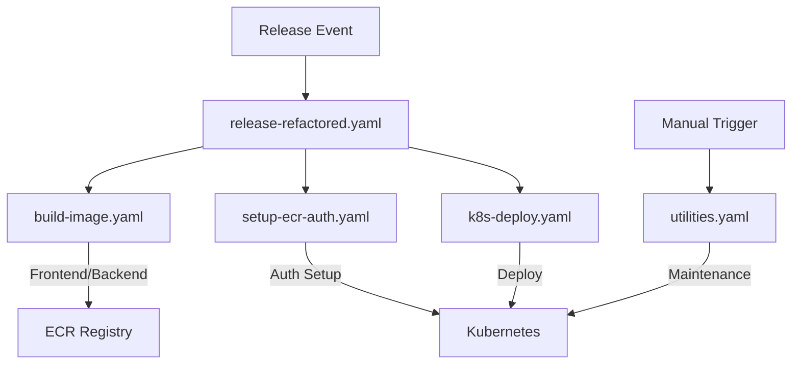

# GitHub Actions Workflows Documentation

## Overview

This repository uses a modular workflow architecture for CI/CD operations. Each workflow has a specific responsibility, making them reusable and maintainable.

## Workflow Architecture



## Workflow Files

### 1. `release-refactored.yaml` (Main Orchestrator)

**Purpose**: Main release workflow that coordinates all operations

- Determines what to build based on release tags
- Orchestrates build, auth setup, and deployment
- Generates appropriate image tags

**Triggers**: GitHub Release (published)

**Tag Patterns**:

- `v1.0.0` → Builds both frontend and backend
- `frontend-v1.0.0` → Builds only frontend
- `backend-v1.0.0` → Builds only backend

### 2. `build-image.yaml` (Build Service)

**Purpose**: Builds and pushes Docker images to ECR

- Handles Docker build process
- Pushes to ECR registry
- Returns image URI for deployment

**Reusable**: ✅ Called by release workflow

### 3. `setup-ecr-auth.yaml` (Authentication Service)

**Purpose**: Sets up ECR authentication in Kubernetes

- Creates ECR image pull secrets
- Handles AWS authentication
- Manages Kubernetes secrets

**Reusable**: ✅ Called by release workflow

### 4. `k8s-deploy.yaml` (Deployment Service)

**Purpose**: Deploys applications to Kubernetes

- Updates deployment images
- Configures image pull secrets
- Verifies deployment success
- Provides detailed debugging on failures

**Reusable**: ✅ Called by release workflow

### 5. `validate-image.yaml` (Validation Service)

**Purpose**: Validates image existence in ECR

- Checks if image exists before deployment
- Cleans invalid characters from tags
- Lists available images if validation fails

**Reusable**: ✅ Can be called standalone or as part of other workflows

### 6. `utilities.yaml` (Maintenance Service)

**Purpose**: Manual operations and maintenance tasks

- Clean old ECR images
- Restart deployments
- Show cluster status
- Troubleshooting utilities

**Triggers**: Manual (workflow_dispatch)

### 7. Legacy Files

- `release.yaml` - Original monolithic workflow
- `deploy-k8s.yaml` - Original deployment workflow

_(These can be removed after confirming the refactored version works)_

## Required Secrets

### AWS (ECR)

```
AWS_ACCESS_KEY_ID           # AWS Access Key
AWS_SECRET_ACCESS_KEY       # AWS Secret Key
AWS_REGION                  # e.g., ap-southeast-1
ECR_REGISTRY               # ECR registry URL
```

### DigitalOcean (Kubernetes)

```
DIGITALOCEAN_ACCESS_TOKEN   # DO API Token
DO_CLUSTER_ID              # Kubernetes Cluster ID
```

### Optional

```
ECR_FRONTEND_REPOSITORY     # If using separate repos
ECR_BACKEND_REPOSITORY      # If using separate repos
```

## Usage Examples

### Release Deployment

1. **Create Release**: Tag with `v1.0.0`, `frontend-v1.0.0`, or `backend-v1.0.0`
2. **Automatic Process**:
   - Builds appropriate images
   - Sets up ECR authentication
   - Deploys to Kubernetes
   - Verifies deployment

### Manual Operations

1. **Clean ECR**: `Actions → Utilities → clean-ecr`
2. **Restart Deployments**: `Actions → Utilities → restart-deployments`
3. **Check Status**: `Actions → Utilities → show-cluster-status`

## Benefits of Refactored Architecture

### ✅ **Modularity**

- Each workflow has single responsibility
- Easy to test individual components
- Reusable across projects

### ✅ **Maintainability**

- Easier to debug specific issues
- Clear separation of concerns
- Reduced code duplication

### ✅ **Flexibility**

- Can call individual workflows manually
- Easy to add new services
- Environment-specific configurations

### ✅ **Debugging**

- Better error isolation
- Detailed logging per component
- Easier troubleshooting

## Migration Guide

### From Legacy to Refactored

1. **Test refactored workflow** with a test release
2. **Verify all functions work** as expected
3. **Update release process** to use new workflow
4. **Remove legacy files** once confirmed stable

### Rollback Plan

Legacy workflows remain in place for quick rollback if needed.

## Troubleshooting

### Common Issues

1. **Image not found**: Use `validate-image.yaml` to check ECR
2. **Deployment fails**: Use `utilities.yaml` to check cluster status
3. **Authentication errors**: Re-run `setup-ecr-auth.yaml`

### Debug Commands

```bash
# Check ECR images
aws ecr describe-images --repository-name chatapp-server

# Check Kubernetes status
kubectl get pods -n app-ns
kubectl describe deployment nextjs-app -n app-ns

# Check secrets
kubectl get secrets -n app-ns
```

## Future Improvements

- [ ] Add staging environment workflows
- [ ] Implement blue-green deployment
- [ ] Add automated testing workflows
- [ ] Monitoring and alerting integration
